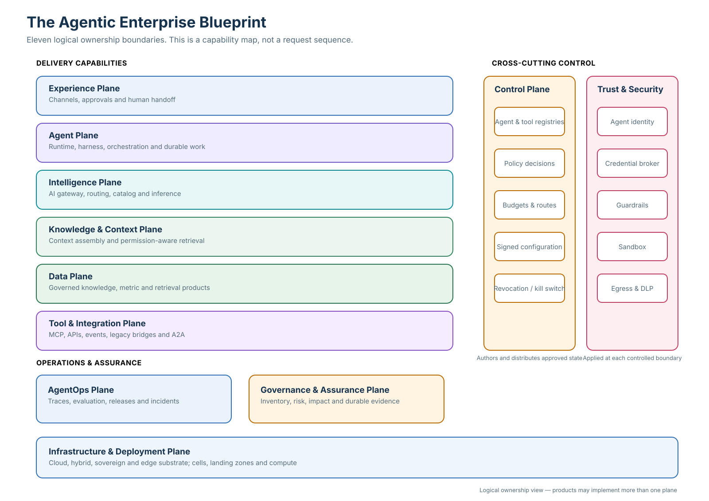

# The Agentic Enterprise Blueprint

## A reference architecture for governing agents at enterprise scale

Most enterprises do not have one AI stack. They have productivity copilots, agents embedded in SaaS platforms, data-platform assistants and custom agents built by several teams. Each arrives with its own identity assumptions, tools, logs and administration console.

The resulting problem is larger than model selection. Leaders in financial services, healthcare and other regulated industries need to decide which capabilities must be shared, which may remain federated, where policy is enforced and how the enterprise proves what an agent did across vendor boundaries.

This blueprint provides that map. It separates the platform into eleven logical planes and explains their interaction through three paths: **serve**, **decide and protect**, and **observe and prove**. It is designed for environments where delegated action, sensitive data, audit evidence and recovery cannot be left to each agent team.

> Build enterprise AI as a platform of owned capabilities. Buy useful substrate, own the seams and evidence, and build the agents that differentiate the business.

The architecture separates three kinds of work that fail differently. **Serve** carries live requests through governed model, context and tool boundaries. **Decide and protect** authors policy centrally, distributes signed state and enforces it at the boundary where an action can occur. **Observe and prove** records operations, evaluates behavior, reconciles side effects and preserves evidence outside the runtime team's write authority. Infrastructure supports all three paths.

This separation lets approved low-risk work continue from valid local state during a control-plane outage, while revocation follows a faster restriction path. It also prevents a successful trace from being mistaken for proof that a consequential action reached its destination.

For plane contracts, the runtime sequence, the reference deployment, decision rights and review scenarios, see [Architecture detail](architecture.md).

The planes are logical ownership boundaries. One product may implement parts of several planes, and one plane may run in several clouds or business units. The boundaries remain useful because they make responsibilities, interfaces and failure behavior explicit.

## The decisions this architecture makes visible

Before choosing products, an executive team should settle five decisions:

1. **Platform topology:** Will delivery start centrally, or do current demand and domain scale already justify a hub-and-spoke model?
2. **Runtime mediation:** Which enterprise-controlled model, tool and agent-to-agent boundaries must be mediated, and how will embedded SaaS agents be registered and observed when their internal calls cannot be routed through enterprise gateways?
3. **Control-plane separation:** Which decisions are authored centrally, and which signed state must be evaluated locally so requests survive a control-plane outage?
4. **Sourcing by plane:** Which capabilities should be bought, configured, reused or built, and which interfaces must remain enterprise-owned?
5. **Evidence and accountability:** Who owns each agent, policy, data product, tool and recovery decision, and what evidence must exist before autonomy increases?

These are architecture and operating-model decisions. Selecting an agent framework answers only a small part of them.

## The eleven planes

The runtime paths describe behavior; the planes below assign ownership for the capabilities that make that behavior possible.

| Plane | Owns | Must not become | Accountable leadership |
|---|---|---|---|
| **Experience** | Channels where customers, employees and operators meet AI | The home of business logic or durable agent state | Product and channel leaders |
| **Agent** | Agent runtime, harness, orchestration, sessions and durable workflows | A holder of long-lived credentials or a direct caller of systems of record | Agent platform engineering |
| **Intelligence** | Model access, routing, catalog, inference and model lifecycle | A place for business rules | AI platform and model engineering |
| **Knowledge & Context** | Query-time context assembly, permission-aware retrieval and governed memory over published products | The system of record for enterprise facts | Knowledge-serving platform and domain owners |
| **Data** | Contracted knowledge graphs, semantic metrics, retrieval/vector indexes, lineage and source data | A private copy created for one agent | Data-product owners |
| **Tool & Integration** | MCP services, APIs, events, legacy bridges and agent federation | A back door to databases or privileged systems | Integration platform and domain API owners |
| **Control** | Agent and tool registries, policy decisions, budgets, configuration and revocation | A synchronous dependency that can stop every request | Enterprise AI platform owner |
| **Trust & Security** | Agent identity, short-lived credentials, guardrails, sandboxing, egress control and DLP | A substitute for authorization | CISO and platform security |
| **Governance & Assurance** | AI inventory, risk tiering, impact assessment and tamper-evident evidence | A review board detached from delivery | AI governance, risk and audit |
| **AgentOps** | Traces, evaluation, feedback, release gates and incident response | Instrumentation added after deployment | AI reliability and evaluation owners |
| **Infrastructure & Deployment** | Cloud, hybrid and sovereign footprints, cells, landing zones and compute | The place where business policy is defined | Cloud and infrastructure engineering |

The final column names the leadership accountable for each plane. A platform can centralize capabilities without assigning every business decision to one team. Domain leaders remain accountable for the actions their agents take.

## Three paths through one platform

### 1. Serve

The request path carries live work. A person, business event or external agent invokes an agent. The runtime assembles approved context, calls a model through the AI gateway and invokes privileged tools through a mediated integration gateway. The runtime holds no long-lived credentials; when a destination call is permitted, it receives a short-lived delegated token. It has no direct network route to a system of record.

### 2. Decide and protect

Policy is authored centrally but enforced at each enterprise-controlled privileged boundary. The model gateway, tool gateway, retrieval service and agent gateway act as policy-enforcement points. They evaluate signed, versioned policy locally, obtain short-lived delegated credentials when required and apply guardrails at the relevant crossing. Embedded SaaS agents whose internal calls cannot be intercepted must still be inventoried, assigned accountable owners, connected to enterprise identity where the product permits it and observed through exported events and logs.

The distinction matters during failure. If the central control plane is unavailable, teams cannot publish new agents or policies, but existing low-risk requests can continue from the last valid configuration according to an explicit stale-policy rule. Revocation and kill-switch messages use a faster distribution path with a short validity period.

Each enforcement point acknowledges its active policy version and renews a short lease. If acknowledgements stop or the lease expires, monitoring shows the coverage gap and that boundary automatically restricts work according to its risk tier.

### 3. Observe and prove

Each runtime component emits traces, decisions, cost and quality signals asynchronously. The evaluation service uses them for release and runtime checks. Consequential actions also create a durable action record correlated with the destination request and outcome. Material decisions, approvals and reconciled side effects are sealed into an evidence store outside the write authority of the runtime team.

Observability supports diagnosis; the action record supports recovery; evidence supports accountability. They share correlation identifiers, but they do not have the same retention, access or integrity requirements.

## Five platform patterns

| Pattern | Decision | Consequence |
|---|---|---|
| **Platform as a product** | Treat builders, operators, risk teams and domain owners as customers of published platform capabilities with owners and service objectives. | Adoption becomes a product outcome. A central team that is slower than the unmanaged path will be bypassed. |
| **Control and serving-path separation** | Author policy and configuration centrally; distribute signed versions for local enforcement. | Serving can survive control-plane failure, but the enterprise must define freshness, revocation and fail-open/fail-closed behavior. |
| **Paved roads** | Provide supported templates for common agent types with identity, gateways, telemetry, evaluation and release controls already connected. | Controls arrive with the first deployment. Exceptions remain possible, but carry an explicit cost and owner. |
| **Federated hub and spokes** | Centralize inventory, security policy, evidence and shared gateways; let domains own agents, data products, knowledge and domain tools. | Domain speed increases without creating a separate control model for every business unit. Decision rights must be written before federation begins. |
| **Open, versioned seams** | Keep enterprise-owned contracts between planes and adapt products to them. | Products and model providers become more replaceable, while conformance testing and protocol-version management become permanent responsibilities. |

### Anti-patterns to stop early

- **A control plane per vendor:** no enterprise inventory can answer which agents have authority across suites.
- **The agent with a key ring:** the runtime stores long-lived API keys and reaches models, databases and systems of record directly.
- **Eleven planes before one useful agent:** the reference architecture is mistaken for a build sequence, creating a long platform program without a business outcome.
- **Approval at the end:** teams build first and discover identity, policy, evidence and evaluation requirements before release.
- **A single giant agent:** one runtime accumulates tools, permissions and context until neither its behavior nor its blast radius is understandable.

## Build, buy and own

The decision is not “build everything” or “buy one suite.” Make a sourcing decision for each plane while preserving enterprise accountability at the boundaries.

| Capability | Prefer buying or configuring when | Build or extend when | The enterprise still owns |
|---|---|---|---|
| Model and agent runtime substrate | Managed services meet isolation, geography, reliability and portability needs | Workload economics, sovereignty or a differentiating runtime require it | Runtime contract, approved configurations, exit plan and service objectives |
| Gateways and policy enforcement | A product supports required protocols and local policy evaluation | Cross-vendor mediation or business-specific obligations are missing | Policy meaning, identity mapping, routing rules and decision evidence |
| Knowledge and data services | Existing platforms satisfy product contracts and permission-aware access | Domain relationships, metrics or retrieval behavior differentiate the business | Definitions, quality, lineage, permissions and product ownership |
| Evaluation and observability | A platform captures portable traces and supports representative evaluations | Business outcomes, risk cases or cross-platform comparisons need custom tests | Acceptance criteria, evaluation sets, release decision and incident diagnosis |
| Agents and workflows | A packaged agent fits the process, controls and integration boundaries | The workflow or decision logic creates competitive advantage | Business outcome, authority, exception handling and recovery |

Buying implementation does not transfer accountability. The enterprise must still know who can change policy, how an action is attributed, what happens during a partial failure and how to leave the product.

Compare three-year cost across the same categories: licenses and consumption, integration and data movement, controls and evidence, specialist operations, resilience, change and exit. For third parties, also test provider concentration, model or subcontractor changes, audit access, incident notification, residency and evidence export.

## Operating model

The architecture works when technical boundaries and decision rights match.

- **The executive sponsor** owns the business outcome, risk appetite and funding decision.
- **The enterprise AI platform owner** owns shared planes, paved-road adoption, reliability and cross-vendor coherence.
- **Domain product owners** own agents, workflow outcomes, domain tools, data products and exception handling.
- **Security and identity owners** define authentication, delegated authority, credential exchange and egress policy.
- **Risk and assurance partners** define evidence and review obligations by use-case tier, then encode repeatable checks into delivery.
- **AgentOps owners** operate tracing, evaluation, release gates, incident response and the path to restrict or revoke an agent.

A central architecture board should decide boundaries and exceptions. It should not manually approve every low-risk release. Standard cases should inherit controls from the paved road and produce their evidence automatically.

## A staged adoption path

### Increment 1 — prove one complete path

Choose one bounded workflow with an accountable owner and a measurable baseline. Connect a thin slice of the required planes: identity, runtime, one model route, one knowledge source, one mediated tool, tracing, evaluation and recovery. The outcome is a working vertical path, not eleven completed platform programs.

Exit only after the team has tested a control-plane outage, reconciled a timed-out write, named the operational owner and compared the workflow result with the baseline including human exception effort.

### Increment 2 — turn the path into a product

Extract the reusable capabilities into a supported template. Publish interfaces and service objectives, add a second agent from another team, and measure whether adoption reduces duplicate integration and control work.

### Increment 3 — federate on evidence

Move to hub-and-spoke delivery when central demand becomes a constraint or several domains need independent release cadence. Keep one inventory, common identity, a central policy floor, portable traces and attributable cost. Domains may tighten controls; they may not silently weaken the enterprise floor.

Use observable triggers for federation: sustained platform queues, missed release objectives, domain-specific regulatory obligations or repeated exceptions that one central team cannot responsibly resolve.

## Measures that reveal whether the platform works

- Time from an approved use case to its first controlled production release.
- Share of production agents using supported paths, measured from runtime traffic.
- Share of model, tool and agent calls crossing the required enforcement points.
- Platform-added latency and cost per task.
- Share of production incidents or material defects that passed the pre-release evaluation set.
- Time to restrict an agent after an incident, and the resulting reconciliation backlog.
- Duplicate connectors, private agent registries and unmanaged credentials retired.
- Cost and quality by agent, domain and business outcome, including human exception effort.

No single metric proves value. Leaders should connect these platform measures to the workflow outcome the agent was funded to improve.

The program should advance beyond Increment 1 only when the workflow outcome improves after accounting for platform consumption, human exception effort, control operation and recovery work. A technically successful agent that does not improve the funded outcome should be narrowed or stopped.

## Failure questions for an architecture review

1. What continues when the control plane is unavailable for an hour?
2. How quickly does revocation reach every enforcement point, and what happens to work already in flight?
3. Can an agent call a model, tool, data source or another agent without crossing a managed boundary?
4. Which identity appears in the destination system: the person, the agent or both?
5. Where are uncertain writes reconciled, and who owns the unresolved queue?
6. Can the enterprise reconstruct the policy, model, context, tool and approval versions behind a consequential action?
7. What must change if a model provider, runtime or agent suite is replaced?

An embedded SaaS agent that cannot provide minimum attribution, restriction and evidence capabilities should have its reachable actions limited or be excluded from consequential workflows.

## What the executive team should do next

Convene one working session with the business sponsor, enterprise AI platform owner, domain owner, security, risk, data and operations. Leave with one funded decision record, not a generic transformation program:

1. Select one bounded workflow and record its current performance, operating effort, exception rate and failure cost.
2. Map the capabilities already available against the eleven planes, including owners, gaps and unmanaged paths.
3. Record a build, configure, reuse or buy decision for each required capability, with three-year cost, operating responsibility and exit criteria.
4. Approve a thin-slice release plan with named decision rights, minimum evidence, recovery tests and explicit continue, narrow or stop gates.

The first release should prove one complete path through identity, context, model access, a mediated action, evaluation and recovery. It should not wait for all eleven planes to become enterprise programs.

## How this connects to the rest of the portfolio

This reference architecture is the map. Three companion papers go deeper into decisions that deserve their own treatment:

- [Earned Autonomy](https://github.com/appliedgenai/earned-autonomy) — how an agent earns and loses authority for each class of action.
- [From Intent to Production](https://github.com/appliedgenai/intent-to-production) — how intent, specifications, context and evidence become an AI-native delivery system.
- [Data Products for the Agent Economy](https://github.com/appliedgenai/agent-data-products) — how knowledge graphs, semantic metrics and retrieval indexes become governed products for many agents.

## About the book and author

This guide is adapted from Chapter 2 of Mohit Mittal's manuscript, *The Agentic Enterprise: Patterns and Reference Architectures for Enterprise AI Adoption*. The 2026 manuscript develops the architecture across 21 chapters covering governance, control planes, model strategy, AgentOps, knowledge, data, context, agents, multi-agent systems, AI-native delivery and enterprise adoption. See [BOOK.md](BOOK.md) for the structure and intended reading paths.

Mohit Mittal is a Chief Architect with 22+ years of experience in enterprise architecture, distributed systems and AI-enabled platforms. At Chegg, he led product, data and AI architecture for a platform serving millions of paying subscribers. His work included production LLM/RAG capabilities and agentic workflows. In healthcare, he has defined target-state architecture for a multi-tenant, AI-native EMR platform incorporating governed agent workflows, policy enforcement and auditability.

This is an independent reference architecture. Organizations should validate its boundaries, service objectives and sourcing decisions against their workloads, risk obligations and existing platforms.

## Standards and sources

The architecture uses open standards as seams, not as evidence that implementations are interchangeable. MCP, A2A and OpenTelemetry conventions continue to evolve; pin versions and run conformance tests. Primary references and scope notes are in [SOURCES.md](SOURCES.md).

Content is available under [CC BY 4.0](LICENSE.md).
