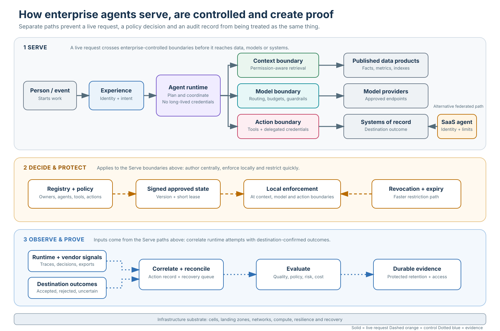
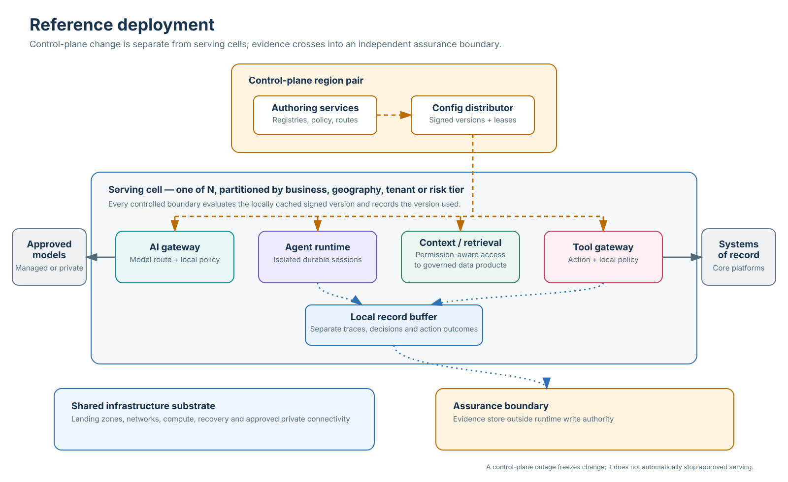

# Architecture detail

This document expands the boundaries, interfaces and failure behavior behind the [Agentic Enterprise Reference Architecture](README.md). It is a design guide, not a deployment claim or product prescription.

## Design rules

1. **The agent runtime is treated as untrusted orchestration.** It holds no long-lived secrets and reaches models, tools, data or peer agents only through mediated interfaces.
2. **Authorization is evaluated at the boundary where an action can occur.** A guardrail may classify content; it cannot grant business authority.
3. **Policy is authored centrally and evaluated locally.** The serving path uses signed, versioned state and records the version behind each decision.
4. **Identity follows delegation.** Destination systems should be able to distinguish the person, service and agent involved in an action.
5. **Telemetry and evidence are separate products.** Operations needs searchable traces; assurance needs integrity, retention and access controls that the runtime cannot change.
6. **Knowledge is published as a product and assembled at request time.** Data-product owners publish governed knowledge graphs, semantic metrics and retrieval indexes; the Knowledge & Context Plane serves and assembles them within the task's permissions and token budget. Ownership, lineage and correction remain outside prompt code.
7. **Long-running side effects require durable state.** Work that waits on people, retries writes or spans days belongs in a durable workflow engine with explicit compensation and reconciliation.
8. **Every seam has a version, owner and conformance test.** Open protocols reduce coupling only when the enterprise manages them as contracts.

## Plane contracts

| Plane | Published contract | Normal degraded behavior | Material failure that must stop work |
|---|---|---|---|
| Experience | Session/invocation API, streaming events, approval and escalation schema | Queue or save work when a channel is unavailable | Identity or approval attribution cannot be established |
| Agent | Agent manifest, invocation contract, durable task state | Resume from a checkpoint; return partial evidence when a deadline expires | State cannot be reconciled after a side effect |
| Intelligence | Provider-neutral model request, routing policy and model catalog | Route to an evaluated fallback within data and cost constraints | No approved model satisfies the task's data or risk tier |
| Knowledge & Context | Context/retrieval request and response with source, permission, time and product-version metadata | Return a bounded answer or request human input when evidence is absent | Permission-aware retrieval or source attribution cannot be enforced |
| Data | Product contract for knowledge graph, metric, retrieval index or source data: meaning, freshness, quality, owner and change policy | Serve the last valid product version only where staleness is allowed | Required product contract or access policy is unavailable |
| Tool & Integration | Versioned MCP/API/event/A2A contract and idempotency semantics | Queue retry-safe work; route ambiguous outcomes to reconciliation | Authority, destination guarantees or outcome-query semantics are unknown |
| Control | Registries, policies, budgets and signed configuration bundles | Freeze changes; serving uses the last valid bundle | Revocation cannot be distributed within the required window |
| Trust & Security | Agent identity, token exchange, sandbox and egress policy | Restrict to lower-risk operations or deny | Credential scope, data boundary or execution isolation cannot be proven |
| Governance & Assurance | Inventory, tier, approval and evidence-record schemas | Defer non-consequential reporting; keep runtime evidence buffered | Consequential action cannot produce required evidence |
| AgentOps | Trace, evaluation, feedback, release and incident contracts | Buffer telemetry; apply conservative release/restriction policy | A high-risk agent is unobservable or cannot be restricted |
| Infrastructure & Deployment | Landing-zone, cell, geography, capacity and recovery contracts | Shed optional work; route within approved geography | Required isolation, residency or recovery objective cannot be maintained |

## Runtime sequence

1. A person, event or federated agent invokes an approved agent version.
2. The experience boundary establishes the initiating identity and intended task.
3. The runtime loads the agent manifest and a valid configuration snapshot.
4. Input guardrails classify and sanitize content; they do not authorize action.
5. The context assembler requests permission-aware evidence from knowledge and data products.
6. The runtime calls a model through the AI gateway, which applies routing, data-class and budget policy.
7. When the model proposes a tool call, the tool gateway evaluates the agent, user, action, resource and context against policy.
8. The credential broker exchanges the delegated identity for a short-lived destination token.
9. The gateway calls the destination with idempotency and correlation identifiers.
10. The result passes through output and tool-result controls, then returns to the durable task state.
11. For each consequential tool call, the platform records the destination, idempotency key, request state and known outcome; uncertain outcomes enter reconciliation.
12. Each component emits trace and decision records carrying agent, model, policy, context, tool and configuration versions.
13. The evaluation service applies runtime and outcome checks. Approvals, decisions and reconciled side effects are sealed in the evidence store.

The sequence does not require one centralized product. It requires every enterprise-controlled privileged boundary to perform its assigned role and preserve records that can be correlated across the action and evidence paths. An embedded SaaS agent may keep its internal model and tool path; the enterprise compensates through inventory, accountable ownership, identity integration, exported telemetry, contractual controls and restrictions on the systems it may reach.

## Control-plane and serving-path separation

The control plane owns change: registration, approval, policy authoring, budgets, routes and revocation. The serving path owns execution from already approved state.

The control plane compiles configuration into signed, versioned bundles. A distributor pushes them to gateways, runtimes and retrieval services. Each enforcement point checks locally and records the bundle version used. Ordinary changes and emergency revocation have different distribution objectives.

This produces three explicit failure decisions:

- **Stale state:** each risk tier defines whether the last valid bundle may continue and for how long.
- **Revocation:** emergency restriction has a short validity window and reaches all enforcement points independently of ordinary deployment cadence.
- **Recovery:** returning the control plane does not automatically release paused work. In-flight tasks are reconciled against the new state before resuming.

## Reference deployment

The default deployment separates four concerns:

- A **control-plane region pair** authors and distributes signed state.
- Multiple **serving cells** contain stateless gateways, isolated agent sessions and local policy evaluation, limiting blast radius.
- Approved **model endpoints and systems of record** remain external dependencies reached over explicit private paths where required.
- An **assurance boundary** stores evidence outside the write authority of runtime operators.

Shared GPU capacity or managed model APIs can sit beneath several cells when isolation and geography permit. A cell boundary should follow the blast radius the business is willing to accept: tenant group, business unit, geography or risk tier.

## Responsibility model

| Decision | Accountable | Responsible contributors | Evidence |
|---|---|---|---|
| Fund and continue a use case | Business sponsor | Product, operations, finance, technology | Baseline, outcome measure, operating cost and exception effort |
| Assign risk and autonomy tier | Domain owner and risk authority | Security, architecture, legal/compliance | Intended purpose, action classes, affected parties and control mapping |
| Approve an agent release | Product owner within delegated policy | AgentOps, engineering, domain reviewers | Versioned evaluation results, change record and rollback plan |
| Approve a tool or system boundary | System owner | Security, integration and domain architecture | Contract, action semantics, identity, idempotency and recovery test |
| Change platform policy | Enterprise AI platform owner with policy authority | Security, risk, domain representatives | Policy version, rationale, affected agents and staged rollout result |
| Restrict or revoke an agent | Named operational authority | Incident commander, platform operations, domain owner | Trigger, scope, acknowledgement, work-in-flight decision and reconciliation |
| Accept residual risk | Business and risk authority | Architecture, security, operations | Explicit exception, expiry, compensating controls and owner |

## Build-versus-buy assessment

Compare candidates against the same contract. A purchased platform should not be compared with only the initial coding effort of a custom component. Include integration, data movement, identity, policy operation, observability, support, upgrades, portability and exit.

For each plane, record:

- required interfaces and service objectives;
- existing enterprise capabilities that can be reused;
- vendor or open-source candidates;
- custom work needed to close contract gaps;
- control and evidence ownership;
- three-year operating and change cost;
- export, coexistence and exit behavior;
- failure and recovery tests required before adoption.

## Architecture review scenarios

Test the assembled system through scenarios rather than checking whether boxes exist:

1. The control plane is unavailable while a low-risk agent handles live requests.
2. A policy revokes one write action while read-only work remains permitted.
3. A tool call times out after the destination may have committed the action.
4. The default model provider is unavailable and the fallback model changes behavior.
5. A knowledge source corrects a fact used by several agents.
6. An external SaaS agent calls an internal tool through federation.
7. A trace collector is unavailable during a consequential workflow.
8. A domain team needs an exception to the paved road.
9. An agent is transferred between runtime products without changing its business contract.

Each scenario should name the expected system response, operator response, evidence and recovery exit condition.

## Review checklist

- Are the eleven planes mapped to accountable owners rather than products alone?
- Can every model, knowledge, tool and agent boundary be identified in a runtime trace?
- Does any runtime hold a long-lived credential or have a direct unmediated path?
- Are authorization and guardrails represented as different controls?
- Is policy authored centrally and evaluated without a network round trip to the control plane?
- Are stale-policy, revocation and in-flight-work rules defined by risk tier?
- Can consequential evidence survive compromise of the runtime account?
- Are data products and knowledge services reusable across agents with explicit contracts?
- Are durable workflow, retry, idempotency and reconciliation defined for side effects?
- Does the sourcing decision preserve enterprise-owned interfaces and an exit path?
- Can a second domain adopt the platform without copying the first domain's private assumptions?
- Do platform measures connect to a business workflow outcome?
